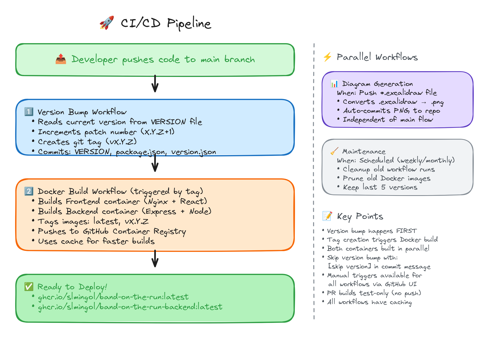

# 🐳 Docker Setup for Band on the Run

## Quick Start

### Prebuilt Container (Recommended)
Use the prebuilt container from GitHub Container Registry:

```bash
# Pull and run the latest version
docker-compose -f docker-compose.prod.yml up -d

# View logs
docker-compose -f docker-compose.prod.yml logs -f

# Stop
docker-compose -f docker-compose.prod.yml down

# Update to latest version
docker-compose -f docker-compose.prod.yml pull
docker-compose -f docker-compose.prod.yml up -d
```

Access the game at: http://localhost:3000

The container is automatically built and published to `ghcr.io/slmingol/band-on-the-run:latest` on every push to main via GitHub Actions.

### Production Build from Source
Build and run the production version with nginx:

```bash
# Build and start
docker-compose up -d

# View logs
docker-compose logs -f

# Stop
docker-compose down
```

Access the game at: http://localhost:3000

### Development Mode
Run with hot reload for development:

```bash
# Build and start development server
docker-compose -f docker-compose.dev.yml up

# Stop
docker-compose -f docker-compose.dev.yml down
```

Access the development server at: http://localhost:3000

## Docker Commands

### Production
```bash
# Build image
docker-compose build

# Start container
docker-compose up -d

# View logs
docker-compose logs -f band-on-the-run

# Restart container
docker-compose restart

# Stop and remove container
docker-compose down

# Rebuild and restart
docker-compose up -d --build
```

### Development
```bash
# Start with live reload
docker-compose -f docker-compose.dev.yml up

# Rebuild dev container
docker-compose -f docker-compose.dev.yml up --build
```

## Manual Docker Commands

### Build production image
```bash
docker build -t band-on-the-run:latest .
```

### Run production container
```bash
docker run -d -p 3000:80 --name band-on-the-run band-on-the-run:latest
```

### Build development image
```bash
docker build -f Dockerfile.dev -t band-on-the-run:dev .
```

### Run development container
```bash
docker run -d -p 3000:5173 -v $(pwd):/app -v /app/node_modules --name band-on-the-run-dev band-on-the-run:dev
```

## Configuration

### Port Configuration
To change the exposed port, modify the ports mapping in `docker-compose.yml`:

```yaml
ports:
  - "8080:80"  # Access app on port 8080
```

## Troubleshooting

### Port already in use
If port 3000 is already in use, change the port mapping:
```yaml
ports:
  - "3001:80"  # Use port 3001 instead
```

### Container won't start
Check logs:
```bash
docker-compose logs band-on-the-run
```

### Rebuild from scratch
```bash
docker-compose down
docker-compose build --no-cache
docker-compose up -d
```

### Clean up everything
```bash
docker-compose down -v
docker system prune -a
```

## GitHub Container Registry

The production Docker image is automatically built and published to GitHub Container Registry on every push to main.

### Pull the latest image
```bash
docker pull ghcr.io/slmingol/band-on-the-run:latest
```

### Available tags
- `latest` - Latest main branch build
- `v1.0.0` - Semantic version tags
- `sha-abc123` - Commit SHA tags

## CI/CD Pipeline



*The CI/CD pipeline automatically versions, builds, and publishes Docker images on every push to main.*

_View the [editable diagram](diagrams/cicd-pipeline.excalidraw) in [Excalidraw](https://excalidraw.com) or VS Code with the Excalidraw extension._

The repository uses GitHub Actions for automated builds and releases:

### Automatic Versioning & Tagging

When code is merged to `main`, the CI pipeline automatically:

1. **auto-version.yml** - Analyzes commit messages and bumps version
   - `major:` or `BREAKING CHANGE` → major version bump (1.0.0 → 2.0.0)
   - `feat:` or `feature:` → minor version bump (1.0.0 → 1.1.0)
   - Other commits → patch version bump (1.0.0 → 1.0.1)
   - Creates a Git tag (e.g., `v1.1.0`)
   - Creates a GitHub Release

2. **docker-build.yml** - Builds and pushes Docker images
   - Triggers on push to `main` and on version tags
   - Extracts version from `package.json`
   - Tags images with multiple formats:
     - `latest` - Latest stable release from main branch
     - `v1.1.0` - Exact semver from package.json
     - `1.1` - Major.minor version
     - `1` - Major version
     - `main-sha123456` - Branch + commit SHA
   - Publishes to GitHub Container Registry (`ghcr.io`)

3. **cleanup-*.yml** - Cleans up old artifacts and Docker images

### Available Image Tags

Pull specific versions using these tags:

```bash
# Latest stable release
docker pull ghcr.io/slmingol/band-on-the-run:latest

# Specific version
docker pull ghcr.io/slmingol/band-on-the-run:v1.1.0
docker pull ghcr.io/slmingol/band-on-the-run:1.1
docker pull ghcr.io/slmingol/band-on-the-run:1

# Specific commit
docker pull ghcr.io/slmingol/band-on-the-run:main-sha123456
```

### Triggering a Release

To create a new release, use conventional commit messages:

```bash
# Patch release (1.0.0 → 1.0.1)
git commit -m "fix: resolve issue with playback"

# Minor release (1.0.0 → 1.1.0)
git commit -m "feat: add new game mode"

# Major release (1.0.0 → 2.0.0)
git commit -m "feat: redesign UI

BREAKING CHANGE: complete UI overhaul"
```

See `.github/workflows/` for workflow details.

## Stem Files in Docker

### Volume Mount for Stem Files

All Docker Compose configurations include a bind mount for stem files:

```yaml
volumes:
  - ./public/audio/stems:/app/public/audio/stems:ro
```

This mounts your local `public/audio/stems` directory into the container at `/app/public/audio/stems` (read-only).

### Using a Custom Stem Location

**Option 1: Modify docker-compose.yml**

```yaml
services:
  band-on-the-run:
    volumes:
      - /custom/path/to/stems:/app/public/audio/stems:ro
```

**Option 2: Use .env file**

Create `.env` in project root:
```bash
STEMS_PATH=/mnt/storage/band-stems
```

Update docker-compose.yml:
```yaml
volumes:
  - ${STEMS_PATH:-./public/audio/stems}:/app/public/audio/stems:ro
```

### Copying Stem Files to/from Container

```bash
# Copy from container to host
docker cp band-on-the-run:/app/public/audio/stems ./stems-backup

# Copy from host to container
docker cp ./stems-backup/ band-on-the-run:/app/public/audio/stems

# Or use bind mount (recommended)
# Stems in ./public/audio/stems are automatically available in container
```

### Sharing Stems Across Multiple Servers

**Option 1: Network Storage (NFS)**

```yaml
volumes:
  - /mnt/nfs/shared-stems:/app/public/audio/stems:ro
```

Mount NFS share on host:
```bash
sudo apt-get install nfs-common
sudo mkdir -p /mnt/nfs/shared-stems
echo "nfs-server:/export/stems /mnt/nfs/shared-stems nfs defaults 0 0" | sudo tee -a /etc/fstab
sudo mount -a
```

**Option 2: Docker Volume with NFS Driver**

```yaml
volumes:
  stems-data:
    driver: local
    driver_opts:
      type: nfs
      o: addr=nfs-server,rw
      device: ":/export/stems"

services:
  band-on-the-run:
    volumes:
      - stems-data:/app/public/audio/stems:ro
```

### Transfer Stems Between Servers

```bash
# Using rsync
rsync -avz --progress \
  public/audio/stems/ \
  user@remote-server:/path/to/band-on-the-run/public/audio/stems/

# Using tar archive
tar -czf stems.tar.gz -C public/audio stems/
scp stems.tar.gz user@remote-server:/tmp/
# On remote server:
tar -xzf /tmp/stems.tar.gz -C /path/to/band-on-the-run/public/audio/

# Using Docker save/load (entire image with stems)
docker save band-on-the-run:latest | gzip > band-app.tar.gz
scp band-app.tar.gz user@remote-server:/tmp/
# On remote server:
docker load < /tmp/band-app.tar.gz
```

### Verify Stems in Container

```bash
# Check if stems directory is mounted
docker exec band-on-the-run ls -la /app/public/audio/stems/

# List stem songs
docker exec band-on-the-run ls /app/public/audio/stems/htdemucs/ | head -10

# Count total stem folders
docker exec band-on-the-run sh -c "ls /app/public/audio/stems/htdemucs/ | wc -l"

# Check single song structure
docker exec band-on-the-run ls -lh /app/public/audio/stems/htdemucs/2Pac_California_Love/
```

### Permissions

If you encounter permission issues:

```bash
# Make stems readable (on host)
chmod -R 755 public/audio/stems

# Or change ownership if needed
sudo chown -R 1000:1000 public/audio/stems

# Then restart container
docker-compose restart
```

### Development vs Production

- **Development**: Stems mounted read-write for processing
- **Production**: Stems mounted read-only (`:ro`) for security

```yaml
# Development
volumes:
  - ./public/audio/stems:/app/public/audio/stems  # Read-write

# Production
volumes:
  - ./public/audio/stems:/app/public/audio/stems:ro  # Read-only
```
